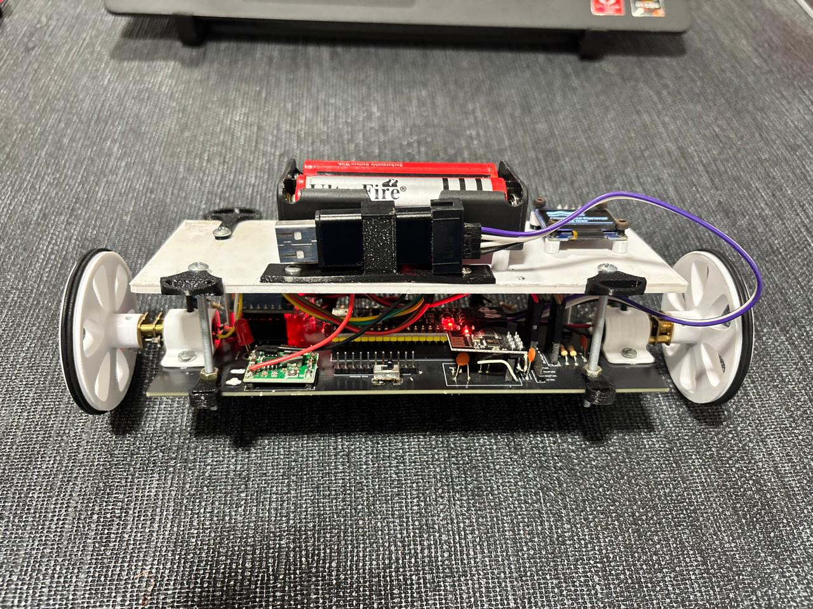
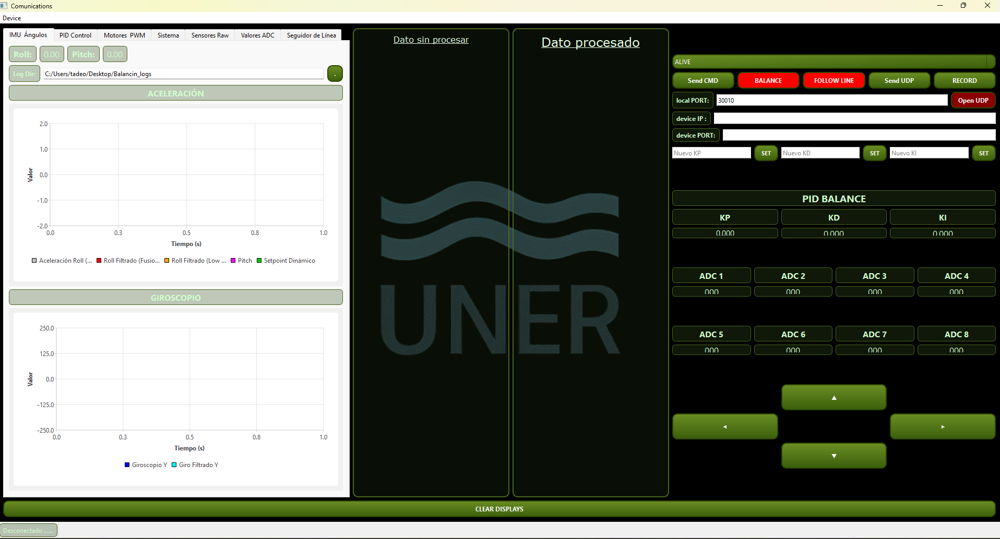

# Self-Balancing Robot · Control PID en Tiempo Real

<div align="center">


<br/>

> **Robot balancín completo sobre STM32F411 (Black Pill):**
> fusión de sensores IMU, filtro complementario, control PID ajustable
> y telemetría WiFi/USB en tiempo real —
> **sin caídas · sin RTOS · sin compromisos.**

<br/>

[](https://www.linkedin.com/in/tadeo-mendelevich/)
[](https://github.com/tadeomendelevich)

</div>

---

## ¿Qué hace este proyecto?

Robot de dos ruedas que se mantiene en equilibrio mediante control PID clásico. El STM32F411 lee el IMU por I²C, fusiona acelerómetro y giroscopio con un filtro complementario, calcula el error de ángulo y corrige los motores — todo dentro de un loop determinístico con dt controlado al microsegundo.

<div align="center">

### 🤖 Sistema en funcionamiento

<br/>


<br/><br/>

### 🔧 Build del sistema

<br/>



<br/><br/>

### 🖥️ Interfaz Qt — Dashboard en tiempo real

<br/>



<br/>

</div>

| Módulo | Descripción |
|--------|-------------|
| 🔵 **MPU6050** | Lee acelerómetro y giroscopio por I²C — datos crudos convertidos a unidades físicas en cada ciclo |
| 📐 **Filtro complementario** | Fusiona el ángulo del acelerómetro (lento, sin drift) con la integración del giroscopio (rápido, sin ruido) — α ajustable |
| 🎛️ **Control PID** | Tres términos en tiempo real: P reacciona al error, I acumula offset estático, D amortigua oscilaciones — con anti-windup |
| ⚙️ **Motores DC** | Comando PWM diferencial con saturación explícita — el robot nunca envía señales fuera de rango al driver |
| 📡 **Telemetría** | Protocolo UNER sobre USB-CDC y WiFi UDP — envía ángulo, error, P/I/D, PWM y dt en cada ciclo |
| 🖥️ **Interfaz Qt** | Dashboard en tiempo real: gráficos de ángulo y PID, ajuste de parámetros en caliente, exportación CSV |

---

## Arquitectura

```
Loop determinístico — dt controlado por timer hardware
│
├── MPU6050 ──► I²C ──► accel_raw + gyro_raw ──► unidades físicas
│
├── Filtro complementario
│       ├── ángulo_accel = atan2(ax, az)
│       └── ángulo_fusionado = α·(ángulo_prev + gyro·dt) + (1−α)·ángulo_accel
│
├── PID
│       ├── error = setpoint − ángulo_fusionado
│       ├── P = Kp · error
│       ├── I = I_prev + Ki · error · dt  (con anti-windup)
│       ├── D = Kd · (error − error_prev) / dt
│       └── output = saturar(P + I + D)
│
├── Motores ──► PWM TIM ──► driver H-bridge ──► ruedas
│
└── Telemetría ──► UNER ──► USB-CDC / WiFi UDP ──► Qt Dashboard
```

> El dt se mide ciclo a ciclo con un timer de alta resolución.
> Si el jitter supera el umbral, el término D se descarta para ese ciclo — sin picos espurios.

---

## Lo más interesante del código

#### 📐 Filtro complementario con α ajustable en runtime
El balance entre acelerómetro y giroscopio se puede cambiar desde la interfaz Qt sin recompilar. Con α alto el robot confía más en el giroscopio (suave pero con drift); con α bajo confía en el acelerómetro (sin drift pero ruidoso). Ajustar esto en vivo sobre el robot físico es lo que permite sintonizar rápido.

#### 🎛️ PID con anti-windup real
El término integral tiene límites explícitos independientes del límite de salida. Si el robot está caído y no puede recuperarse, el integrador no acumula error indefinidamente — al volver al rango de control, la respuesta es limpia sin el "kick" integral que haría caer el robot al otro lado.

#### ⏱️ Gestión del dt ciclo a ciclo
El dt no es una constante fija en el código — se mide en cada iteración con un timer hardware. El término D usa el dt real, no el nominal. Esto hace que el control sea robusto ante interrupciones o picos de carga que alarguen ocasionalmente el ciclo.

#### 📡 Telemetría sin impacto en el loop
Los datos se arman en un buffer doble: el loop de control escribe en uno mientras la USART/WiFi transmite el otro. El tiempo de control nunca espera al canal de comunicación — el rendimiento del PID no depende del baudrate.

#### 🖥️ Ajuste de parámetros en caliente
Kp, Ki, Kd, setpoint y α se reciben por UNER desde Qt y se aplican en el siguiente ciclo. No hace falta detener el robot para sintonizar — se puede ajustar el PID mientras el sistema está balanceando.

---

## Hardware

| Componente | Detalle |
|------------|---------|
| MCU | STM32F411CEU6 (Black Pill) @ 100 MHz |
| IMU | MPU6050 — ±2 g / ±250 °/s, I²C 400 kHz |
| Motores | 2× DC con driver H-bridge, PWM diferencial |
| Comunicación | USB-CDC (debug) + WiFi UDP (telemetría) |
| Interfaz | Qt — gráficos en tiempo real, ajuste PID, exportación CSV |

---

## Variables monitoreadas en tiempo real

| Variable | Descripción |
|----------|-------------|
| `angle` | Ángulo fusionado (filtro complementario) |
| `error` | Diferencia entre setpoint y ángulo actual |
| `P / I / D` | Contribución de cada término al output |
| `pwm_out` | Señal final al motor (pre y post saturación) |
| `dt` | Tiempo real del ciclo — detecta jitter |
| `gyro_raw / accel_raw` | Datos crudos del MPU6050 para diagnóstico |

---

## Estructura del proyecto

```
Core/Src/
├── main.c        — Loop principal, control PID, gestión del dt
├── MPU6050.c     — Driver IMU: I²C, conversión, calibración
├── filter.c      — Filtro complementario con α configurable
├── pid.c         — Controlador PID con anti-windup y saturación
├── motors.c      — PWM diferencial y límites de salida
└── uner.c        — Protocolo de telemetría binario

qt_app/
├── mainwindow.cpp   — Dashboard, gráficos en tiempo real
├── serialworker.cpp — Hilo de comunicación serial/WiFi
└── unerparser.cpp   — Parser de tramas UNER
```

---

<div align="center">

**Tadeo Mendelevich** · Ingeniería en Mecatrónica · UNER — Concordia, Entre Ríos

[](https://www.linkedin.com/in/tadeo-mendelevich/)
[](https://github.com/tadeomendelevich)

</div>
